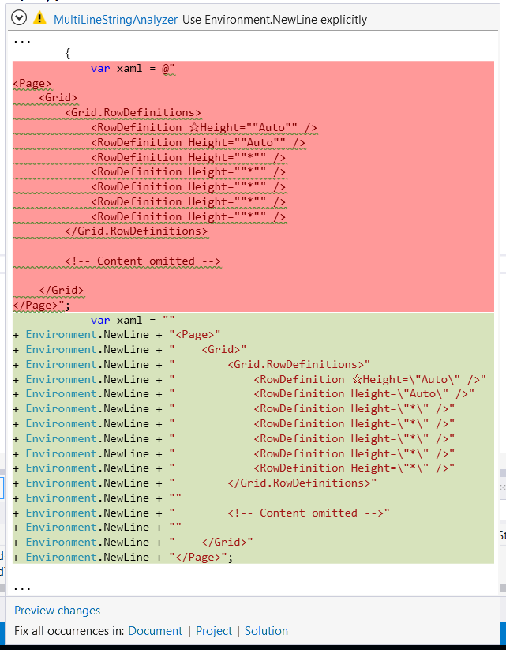

# MultiLineStringAnalyzer

A Roslyn/CodeAnalysis analyzer for splitting multi-line string literals and converting them to use `Environment.NewLine`.

Available as a NuGet package.

`Install-Package MultiLineStringAnalyzer`

This can be useful if you need to do multi-line string comparison on more than just Windows (or Mac/*nix).

It's purpose is to make the conversion faster, easier, and without errors. 

Even though it's an analyzer it's not intended for use as a rule for how all strings should be formatted. Embedded carriage returns (and line feeds) can be really useful. But if you need to do things with strings that adapt to different line-endings then this can be helpful.
